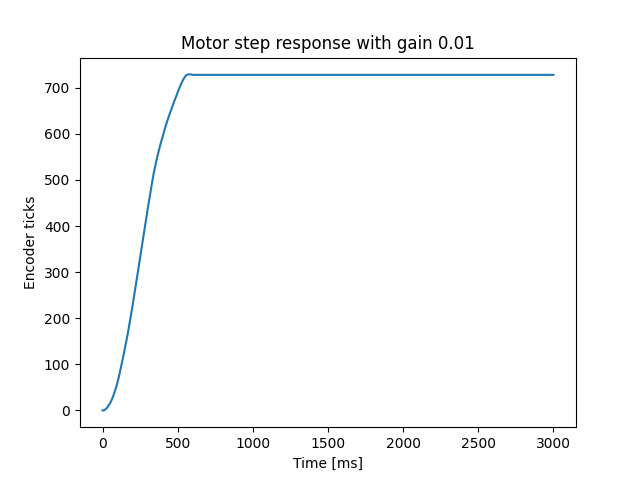
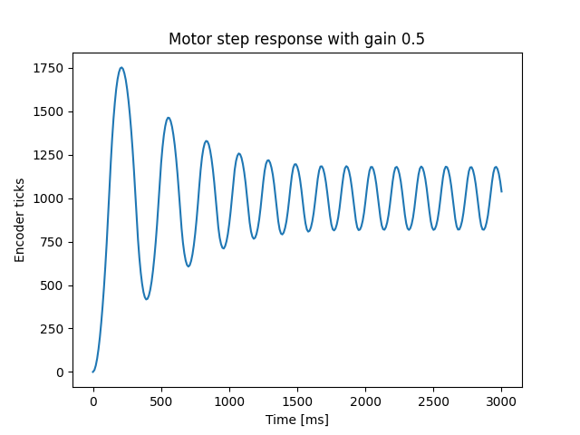
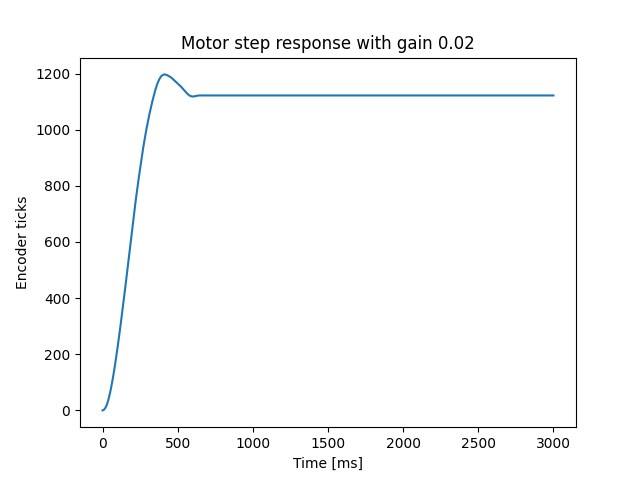

# 405L2 - Motor Proportional Control
## Description

This repository contains code that allows for proportional control of a motor. It also includes the necessary motor and encoder classes required for running the controller class.

The approach used in the included code is measuring the difference in motor position (in encoder ticks) between the current position and a given setpoint. The difference is then multiplied by a gain coefficient, which is then translated directly into a PWM value into the motor driver class. PWM percentages of greater than 100 are reduced to a maximum value of 100 by the motor driver class.

This repository also includes code intended for use on a computer that allows a user to run step response tests. The code running on the computer will communicate a user-defined gain value via UART to the MicroPython board, which will then run the step response test at the given gain value. The step response test is configured such that the 3d printed disc attached to the motor makes one complete revolution (approximately 1000 ticks). During the step response test, the MicroPython board collects time and position data. At the end of 3 seconds, the test stops and the MicroPython communicates the data back to the computer. The computer then parses the data and plots it to visualize the motor response.

## Usage

1. Ensure the REPL on UART 2 is disabled in boot.py in the MicroPython flash.
2. If necessary, modify the COM port number on line 17. By default, it is COM10.
3. Modify the gain value in control_serial.py to the desired value. This line of code is on line 14 and looks like this:

  ```
  gain = 0.05
  ```
  
4. Run main.py on the MicroPython board.
5. Run control_serial.py on the PC.

## Example results



An underdamped response. The motor never reaches the setpoint of 1000 ticks.



An excessive oscillation. The motor never settles onto a final value.



A good response. There is some small overshoot but the motor otherwise settles fairly quickly. The steady state error is due to low PWM percentages being unable to overcome the friction of the system.
